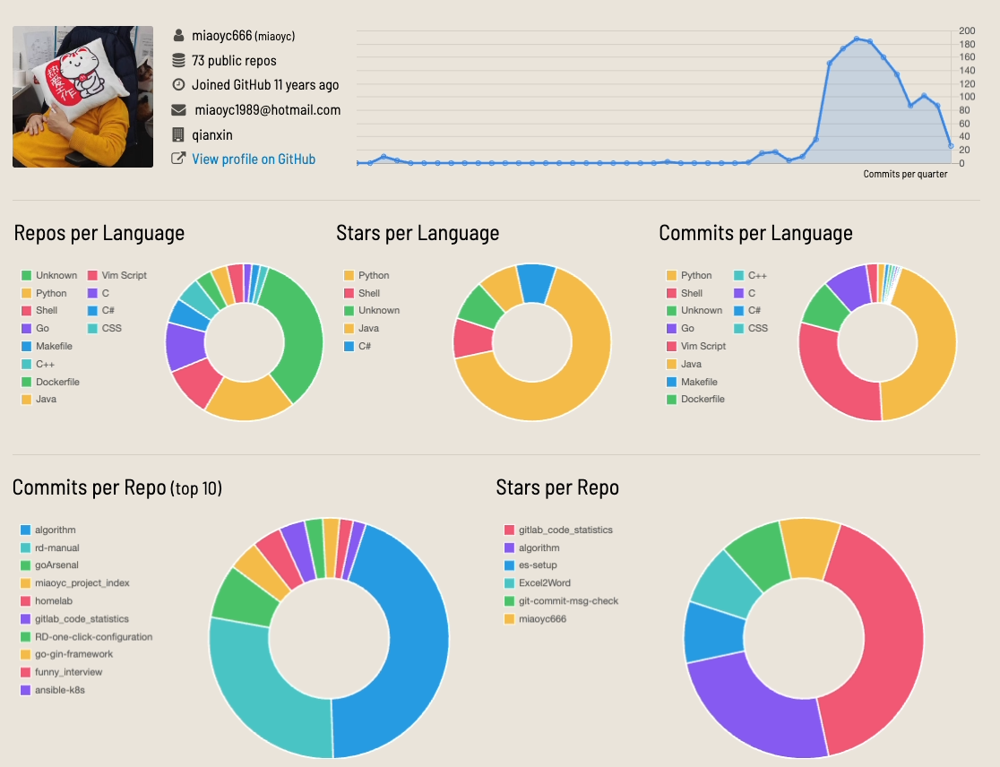
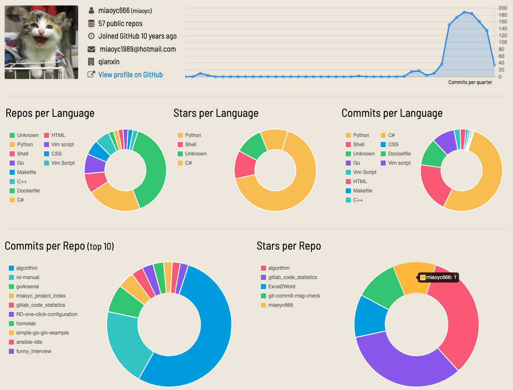
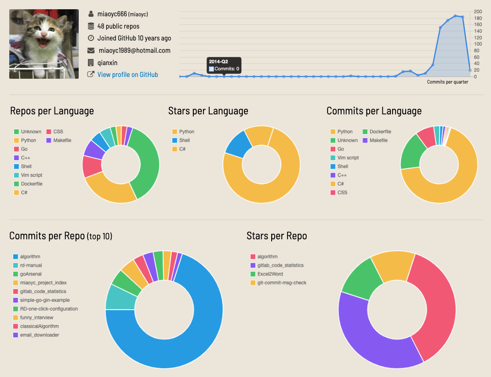
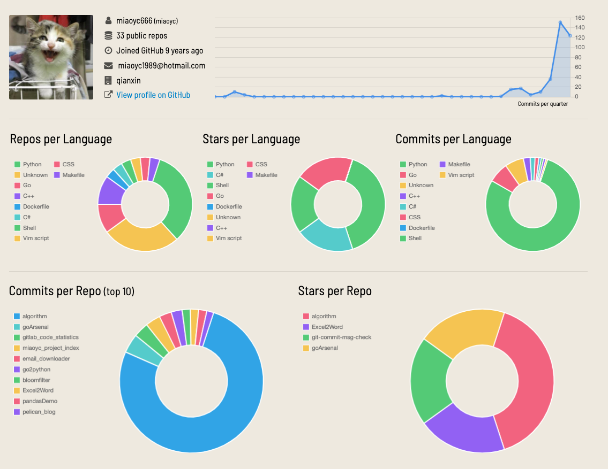
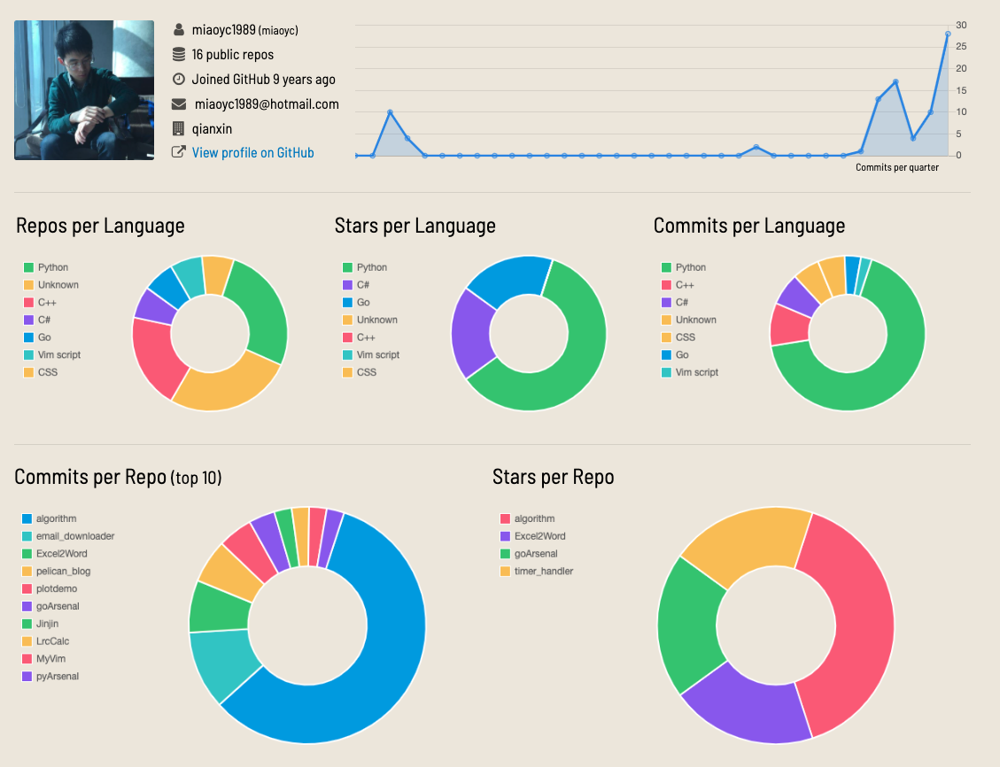

# miaoyc的公开项目索引

#### 公开的服务
-

#### 研发手册
- 个人整理的研发手册速查：[rd-manual](https://github.com/miaoyc666/rd-manual)

#### 刷题
- 不被手册问题难倒，不做低水平面试官：[funny_interview](https://github.com/miaoyc666/funny_interview)
- 算法训练：[algorithm](https://github.com/miaoyc666/algorithm) 

#### 经典数据结构与算法
- 经典算法：[classicalAlgorithm](https://github.com/miaoyc666/classicalAlgorithm)
- 布隆过滤器：[bloomfilter](https://github.com/miaoyc666/bloomfilter)

#### Homelab相关
- 个人密码库部署：[caddy_bitwarden](https://github.com/miaoyc666/caddy_bitwarden)
- Homelab配置：[homelab](https://github.com/miaoyc666/homelab)
- 自动化安装k8s集群：[ansible-k8s](https://github.com/miaoyc666/ansible-k8s)
- squid https代理：[squid-https](https://github.com/miaoyc666/squid-https)

#### 集群配置
- consul: [consul-setup](https://github.com/miaoyc666/consul-setup)
- etdcd：[etcd-setup](https://github.com/miaoyc666/etcd-setup)
- zookeeper：[zookeeper-setup](https://github.com/miaoyc666/zookeeper-setup)
- clickhouse：[clickhouse-setup](https://github.com/miaoyc666/clickhouse-setup)
- es：[es-setup](https://github.com/miaoyc666/es-setup)
- jmeter：[jmeter-setup](https://github.com/miaoyc666/jmeter-setup)

#### Golang武器库
- Golang武器库：[goArsenal](https://github.com/miaoyc666/goArsenal)
- Myself web framework[go-jinjin](https://github.com/miaoyc666/go-jinjin)
- Kratos构建的helloworld：[kratos demo](https://github.com/miaoyc666/kratos-demo)
- 基于Gin的API接口框架示例：[go-gin-framework](https://github.com/miaoyc666/go-gin-framework)
- 基于echo的API接口框架示例：[go-echo-example](https://github.com/miaoyc666/go-echo-example)
- Go常见错误：[go-mistakes](https://github.com/miaoyc666/go-mistakes)
- Go语言实现Python内置函数：[go2python](https://github.com/miaoyc666/go2python)

#### Python武器库
- Python武器库：[pyArsenal](https://github.com/miaoyc666/pyArsenal)
- 基于python官方docker镜像制作的python开发底包：[base-python](https://github.com/miaoyc666/base-python)
- 基于Python Pelican框架的博客模板：[pelican_blog](https://github.com/miaoyc666/pelican_blog)
- tornado demo：[hello_tornado](https://github.com/miaoyc666/hello_tornado)
- flask login：[flask_login_demo](https://github.com/miaoyc666/flask_login_demo)
- django demo：[hello-django](https://github.com/miaoyc666/hello-django)

#### Rust学习
- 基于Rust的sdk库demo：[rust-sdk](https://github.com/miaoyc666/rust-sdk)
- 用Rust语言实现Python内置函数：[rust2python](https://github.com/miaoyc666/rust2python)
- Python开发者如何学习Rust：[pythoner_learn_about_rust](https://github.com/miaoyc666/pythoner_learn_about_rust)
- Rust武器库：[rustArsenal](https://github.com/miaoyc666/rustArsenal)

#### K8s
- docker镜像拉取优化工具：[docker_pull_proxy](pass)

#### 前端
- 前端学习笔记：[fe study](https://github.com/miaoyc666/fe-study)
- docsify：[docsify](https://github.com/miaoyc666/docsify-demo)

#### Git相关
- Gitlab代码行数统计：[gitlab_code_statistics](https://github.com/miaoyc666/gitlab_code_statistics)
- Git提交说明检查工具：[Git-commit-msg-check](https://github.com/miaoyc666/git-commit-msg-check)
- Git提交检查：[pre-commit-lint](https://github.com/miaoyc666/pre-commit-lint)

#### 开发配置
- Vim，[MyVim](https://github.com/miaoyc666/MyVim)
- Git，[mygit](https://github.com/miaoyc666/mygit)
- Sublime-text，[my-sublime-text](https://github.com/miaoyc666/my-sublime-text)
- 默认研发工具一键配置：[RD-one-click-configuration](https://github.com/miaoyc666/RD-one-click-configuration)

#### C/C++/C#归档
- MFC波形绘图组件，[plotdemo](https://github.com/miaoyc666/plotdemo)
- Excel转Word，[Excel2Word](https://github.com/miaoyc666/Excel2Word)
- Lrc计算器，[LrcCalc](https://github.com/miaoyc666/LrcCalc)
- 添加跨平台的Vector和Matrix数据结构，[VectorTest](https://github.com/miaoyc666/VectorTest/tree/master/VectorTest)

#### 项目快照
- 23.10.26

- 23.1.28

- 2022.7.11

- 2021.12.14

- 2021.06.28

