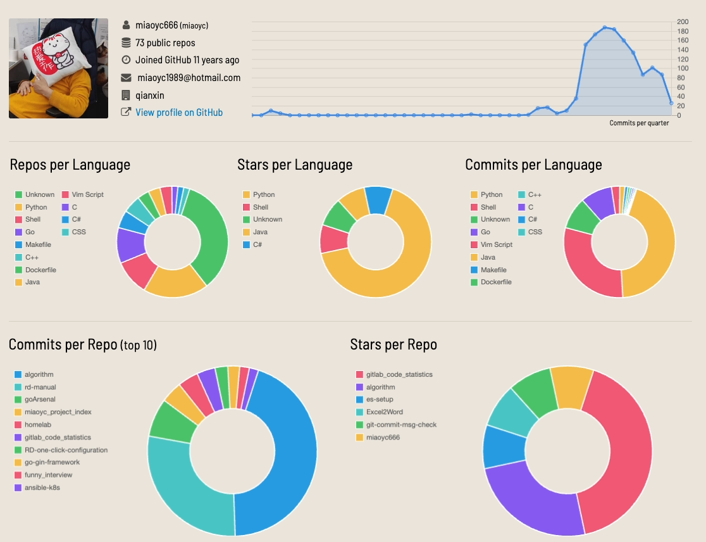
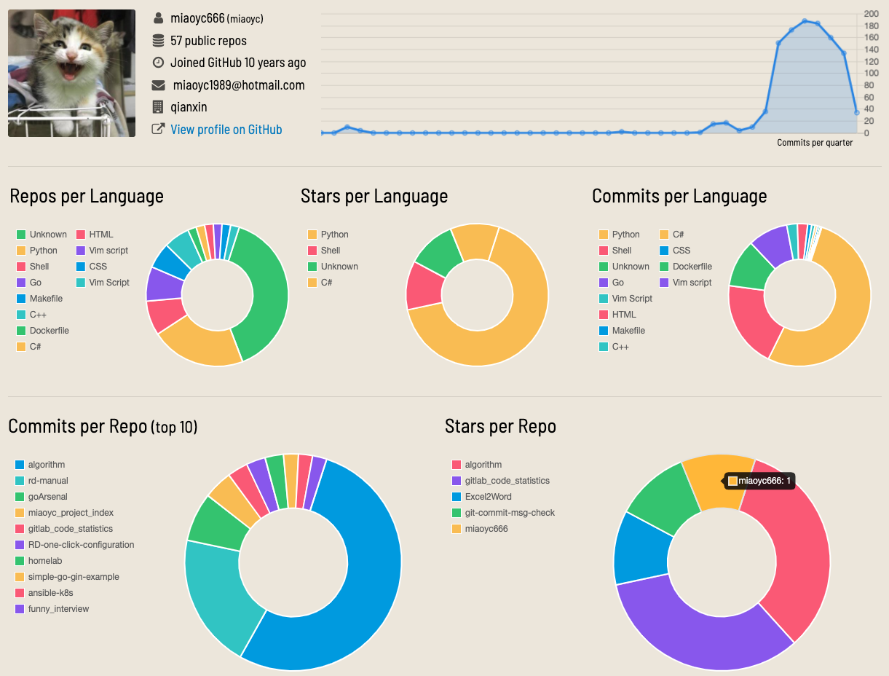
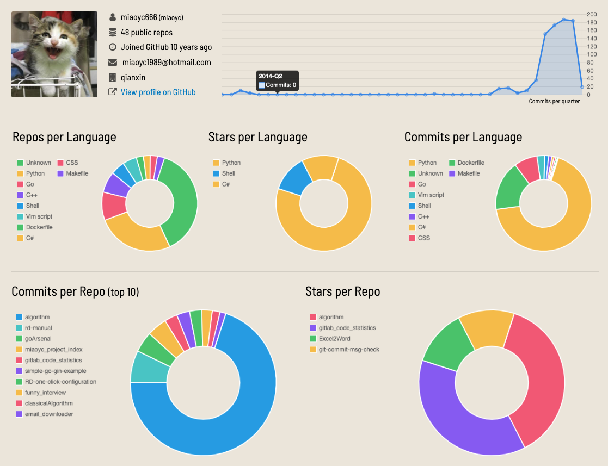
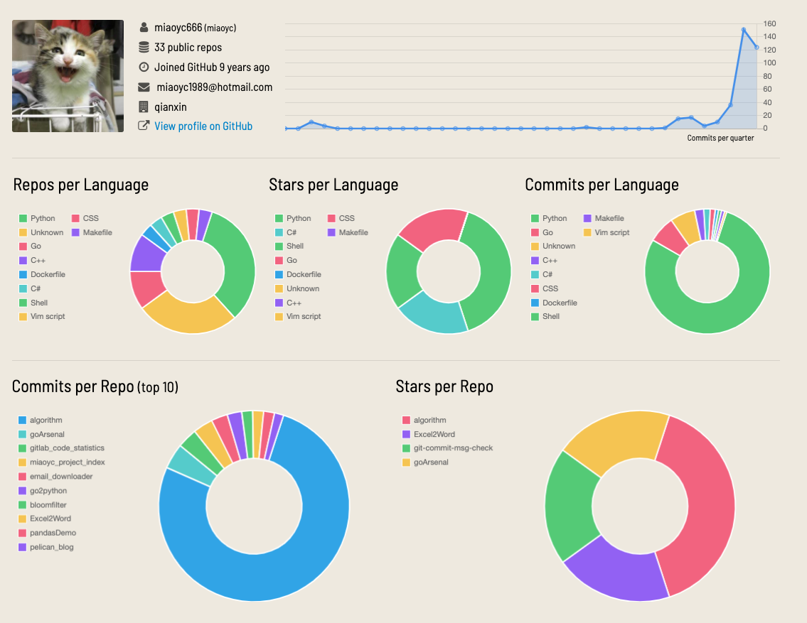
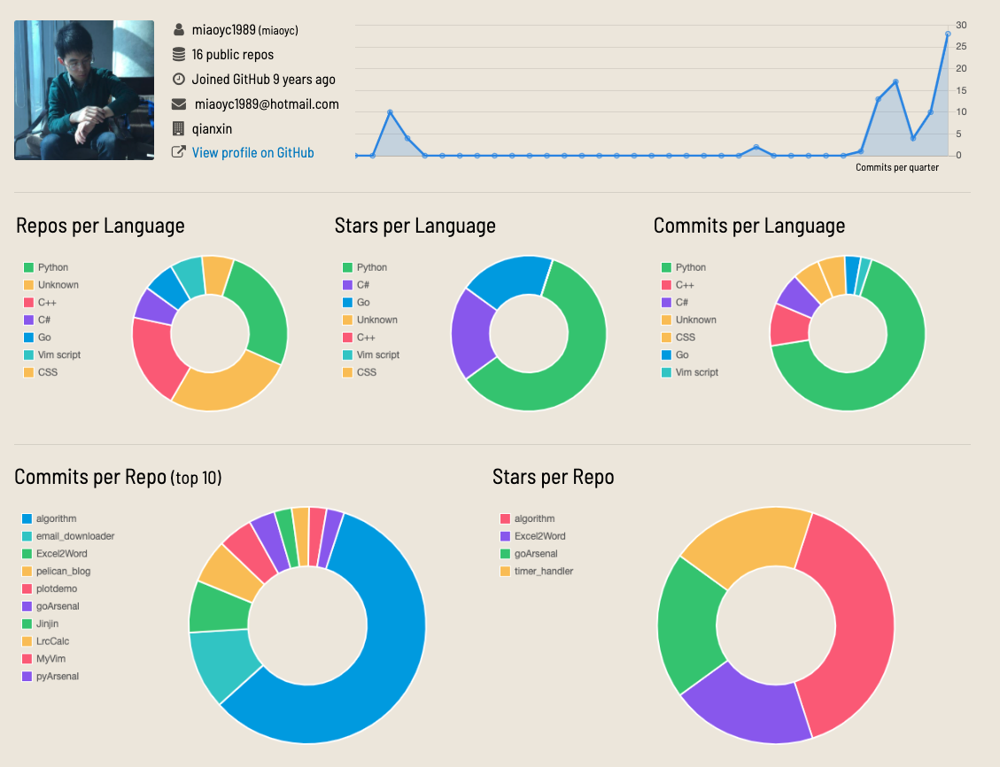

# miaoyc 的公开项目索引

这里整理了我的公开 GitHub 项目，主要涵盖 AI 应用、研发工具、Go/Python/Rust、Homelab、集群部署与算法实践。

- GitHub：[@miaoyc666](https://github.com/miaoyc666)
- 本索引最后更新：2026-07-21
- 项目索引整理：[OpenAI Codex](https://github.com/apps/chatgpt-codex-connector) 协助维护
- 说明：已分类项目保持现有结构，其他公开仓库统一收录在文末的“未分类项目”中；`Fork` 表示复刻项目

## 近期项目

- [ros-aliyun-ddns](https://github.com/miaoyc666/ros-aliyun-ddns)：通过 HTTP 请求更新阿里云 DNS A 记录的 DDNS 中转服务，适用于 RouterOS 等路由器
- [BeyondChats](https://github.com/miaoyc666/BeyondChats)：简洁的多模型聊天工具，支持豆包、ChatGPT、Gemini 等模型
- [deepIntelligence](https://github.com/miaoyc666/deepIntelligence)：AI 落地实践记录
- [ecdh-vg](https://github.com/miaoyc666/ecdh-vg)：基于 ECDH、Vue 和 Go 的全栈加密通信框架
- [xiaoetong-video-downloader](https://github.com/miaoyc666/xiaoetong-video-downloader)：小鹅通视频下载工具
- [RoaringBitmapDemo](https://github.com/miaoyc666/RoaringBitmapDemo)：RoaringBitmap 使用示例

## 研发手册与效率工具

- [rd-manual](https://github.com/miaoyc666/rd-manual)：个人研发手册与命令、语法速查
- [happycode](https://github.com/miaoyc666/happycode)：提升研发效率的 Web 工具集合
- [RD-one-click-configuration](https://github.com/miaoyc666/RD-one-click-configuration)：Linux 研发环境一键初始化脚本

## AI 与安全

- [BeyondChats](https://github.com/miaoyc666/BeyondChats)：多模型聊天工具
- [deepIntelligence](https://github.com/miaoyc666/deepIntelligence)：AI 落地实践记录
- [OSTIP](https://github.com/miaoyc666/OSTIP)：开源威胁情报平台

## Homelab 与网络

- [homelab](https://github.com/miaoyc666/homelab)：Homelab 配置文件集合
- [ros-aliyun-ddns](https://github.com/miaoyc666/ros-aliyun-ddns)：RouterOS/路由器阿里云 DDNS 中转服务
- [caddy_bitwarden](https://github.com/miaoyc666/caddy_bitwarden)：使用 Docker Compose 管理的个人密码库服务
- [ansible-k8s](https://github.com/miaoyc666/ansible-k8s)：使用 Ansible 自动化安装 Kubernetes 集群
- [squid-https](https://github.com/miaoyc666/squid-https)：Squid HTTPS 正向代理
- [nas](https://github.com/miaoyc666/nas)：NAS 配置

## Go 武器库

- [goArsenal](https://github.com/miaoyc666/goArsenal)：Go 常用工具与代码集合
- [go-jinjin](https://github.com/miaoyc666/go-jinjin)：自研 Go Web 框架
- [go-gin-framework](https://github.com/miaoyc666/go-gin-framework)：基于 Gin 的 Web/API 框架示例
- [go-mistakes](https://github.com/miaoyc666/go-mistakes)：Go 常见错误整理
- [go2python](https://github.com/miaoyc666/go2python)：使用 Go 实现 Python 内置函数
- [ecdh-vg](https://github.com/miaoyc666/ecdh-vg)：ECDH + Vue + Go 全栈加密通信框架
- [RoaringBitmapDemo](https://github.com/miaoyc666/RoaringBitmapDemo)：RoaringBitmap 示例
- 框架与工具示例：[gRPC](https://github.com/miaoyc666/grpc_demo)、[Thrift](https://github.com/miaoyc666/thrift_demo)、[Echo](https://github.com/miaoyc666/go-echo-example)、[Kratos](https://github.com/miaoyc666/kratos-demo)、[Ent](https://github.com/miaoyc666/ent_demo)、[Wire](https://github.com/miaoyc666/wire_demo)、[Go SDK/SO](https://github.com/miaoyc666/go-sdk)

## Python 武器库

- [pyArsenal](https://github.com/miaoyc666/pyArsenal)：Python 常用工具集合
- [xiaoetong-video-downloader](https://github.com/miaoyc666/xiaoetong-video-downloader)：小鹅通视频下载工具
- [base-python](https://github.com/miaoyc666/base-python)：基于 Python 官方镜像的开发基础镜像
- [email_downloader](https://github.com/miaoyc666/email_downloader)：支持 IMAP 和 POP3 的邮件下载器
- [pelican_blog](https://github.com/miaoyc666/pelican_blog)：基于 Pelican 的博客模板
- 示例项目：[FastAPI](https://github.com/miaoyc666/fastapi_demo)、[Tornado](https://github.com/miaoyc666/hello_tornado)、[Flask Login](https://github.com/miaoyc666/flask_login_demo)、[Django](https://github.com/miaoyc666/hello-django)、[Pandas](https://github.com/miaoyc666/pandasDemo)

## 算法与面试

- [funny_interview](https://github.com/miaoyc666/funny_interview)：后端技术面试常见问题整理
- [algorithm](https://github.com/miaoyc666/algorithm)：多语言算法训练
- [classicalAlgorithm](https://github.com/miaoyc666/classicalAlgorithm)：使用 Python 实现经典数据结构和算法
- [bloomfilter](https://github.com/miaoyc666/bloomfilter)：布隆过滤器实现

## 集群配置

- [consul-setup](https://github.com/miaoyc666/consul-setup)：Consul 集群配置
- [etcd-setup](https://github.com/miaoyc666/etcd-setup)：etcd 安装和集群配置
- [zookeeper-setup](https://github.com/miaoyc666/zookeeper-setup)：ZooKeeper 集群配置
- [clickhouse-setup](https://github.com/miaoyc666/clickhouse-setup)：ClickHouse 数据库和集群配置
- [es-setup](https://github.com/miaoyc666/es-setup)：Elasticsearch 集群配置
- [rmq-setup](https://github.com/miaoyc666/rmq-setup)：RabbitMQ 集群配置
- [jmeter-setup](https://github.com/miaoyc666/jmeter-setup)：JMeter 主从集群配置
- [k8s-setup](https://github.com/miaoyc666/k8s-setup)：Kubernetes 安装和集群配置

## Rust 学习

- [rust-sdk](https://github.com/miaoyc666/rust-sdk)：跨平台 Rust SDK 示例
- [rust2python](https://github.com/miaoyc666/rust2python)：使用 Rust 实现 Python 内置函数
- [pythoner_learn_about_rust](https://github.com/miaoyc666/pythoner_learn_about_rust)：Python 开发者的 Rust 学习笔记
- [rustArsenal](https://github.com/miaoyc666/rustArsenal)：Rust 工具与代码集合

## 前端

- [fe-library](https://github.com/miaoyc666/fe-library)：前端资料库
- [fe-study](https://github.com/miaoyc666/fe-study)：前端学习笔记
- [docsify-demo](https://github.com/miaoyc666/docsify-demo)：Docsify 文档项目示例

## Git 与开发配置

- [gitlab_code_statistics](https://github.com/miaoyc666/gitlab_code_statistics)：GitLab 代码行数统计
- [git-commit-msg-check](https://github.com/miaoyc666/git-commit-msg-check)：Git 提交说明检查工具
- [pre-commit-lint](https://github.com/miaoyc666/pre-commit-lint)：Git 提交规范检查工具
- [MyVim](https://github.com/miaoyc666/MyVim)：Vim 配置
- [mygit](https://github.com/miaoyc666/mygit)：Git 配置
- [my-sublime-text](https://github.com/miaoyc666/my-sublime-text)：Sublime Text 配置

## 其他语言与历史项目

- [cccArsenal](https://github.com/miaoyc666/cccArsenal)：C 语言工具库
- [JavaArsenal](https://github.com/miaoyc666/JavaArsenal)：Java 工具库
- [plotdemo](https://github.com/miaoyc666/plotdemo)：MFC 波形绘图组件
- [Excel2Word](https://github.com/miaoyc666/Excel2Word)：Excel 数据转 Word 工具
- [LrcCalc](https://github.com/miaoyc666/LrcCalc)：LRC 计算器
- [VectorTest](https://github.com/miaoyc666/VectorTest)：跨平台 Vector 和 Matrix 数据结构

## 未分类项目

以下项目尚未归入上面的分类，其中 `Fork` 表示复刻项目。

- [Mobile-Security-Framework-MobSF](https://github.com/miaoyc666/Mobile-Security-Framework-MobSF) **[Fork]**：Mobile Security Framework（JavaScript）
- [NotionNext](https://github.com/miaoyc666/NotionNext) **[Fork]**：使用 NextJS + Notion API 实现的静态博客（JavaScript）
- [Unla](https://github.com/miaoyc666/Unla) **[Fork]**：MCP Gateway
- [bj-mobile-iptv](https://github.com/miaoyc666/bj-mobile-iptv) **[Fork]**：北京移动 IPTV 播放列表
- [boss-spider](https://github.com/miaoyc666/boss-spider)：Boss spider
- [chatgpt-demo](https://github.com/miaoyc666/chatgpt-demo) **[Fork]**：Minimal web UI for ChatGPT
- [chatgpt-web](https://github.com/miaoyc666/chatgpt-web) **[Fork]**：使用 Express 和 Vue 3 搭建的 ChatGPT 演示网页（Vue）
- [clash](https://github.com/miaoyc666/clash) **[Fork]**：A rule-based tunnel in Go
- [claude-cli-test](https://github.com/miaoyc666/claude-cli-test)：暂无描述
- [claude-code](https://github.com/miaoyc666/claude-code) **[Fork]**：Open source Claude Code CLI source code
- [coze-studio](https://github.com/miaoyc666/coze-studio) **[Fork]**：AI agent development platform
- [dify](https://github.com/miaoyc666/dify) **[Fork]**：Agentic workflow development platform（TypeScript）
- [dify-plugin-daemon](https://github.com/miaoyc666/dify-plugin-daemon) **[Fork]**：暂无描述
- [dify-sandbox](https://github.com/miaoyc666/dify-sandbox) **[Fork]**：安全的代码执行环境（Go）
- [elm-ui](https://github.com/miaoyc666/elm-ui)：Element UI study
- [geeklx](https://github.com/miaoyc666/geeklx) **[Fork]**：暂无描述
- [go-openssl](https://github.com/miaoyc666/go-openssl) **[Fork]**：Go OpenSSL compatible wrapper
- [goblog_server](https://github.com/miaoyc666/goblog_server) **[Fork]**：基于 Gin 和 Vue 3 的博客系统后端
- [goblog_web](https://github.com/miaoyc666/goblog_web) **[Fork]**：基于 Gin 和 Vue 3 的博客系统前端
- [harvester-installer](https://github.com/miaoyc666/harvester-installer) **[Fork]**：暂无描述
- [html_parser](https://github.com/miaoyc666/html_parser)：HTML parser demo（Python）
- [it-tools](https://github.com/miaoyc666/it-tools) **[Fork]**：在线开发工具集合（Vue）
- [mall-learning](https://github.com/miaoyc666/mall-learning) **[Fork]**：Mall 学习教程
- [meow_with_you](https://github.com/miaoyc666/meow_with_you)：喵喵有你
- [miaoyc666](https://github.com/miaoyc666/miaoyc666)：GitHub Profile 仓库
- [miaoyc_project_index](https://github.com/miaoyc666/miaoyc_project_index)：公开项目索引
- [notion-pic](https://github.com/miaoyc666/notion-pic)：Notion Pic
- [orm](https://github.com/miaoyc666/orm)：ORM
- [profile-summary-for-github](https://github.com/miaoyc666/profile-summary-for-github) **[Fork]**：GitHub Profile 可视化工具
- [projector-docker](https://github.com/miaoyc666/projector-docker) **[Fork]**：使用 Docker 远程运行 JetBrains IDE
- [qtDemo](https://github.com/miaoyc666/qtDemo)：Qt browser demo
- [ragflow](https://github.com/miaoyc666/ragflow) **[Fork]**：RAG engine（Python）
- [slowpan](https://github.com/miaoyc666/slowpan)：慢网盘
- [vitess-sqlparser](https://github.com/miaoyc666/vitess-sqlparser) **[Fork]**：SQL Parser for Go

## 项目快照

- 2023-10-26

  

- 2023-01-28

  

- 2022-07-11

  

- 2021-12-14

  

- 2021-06-28

  
